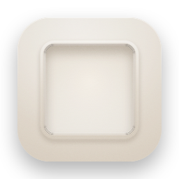
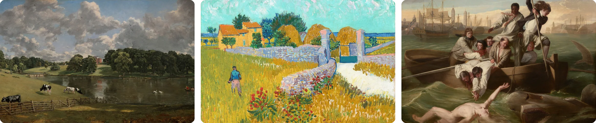
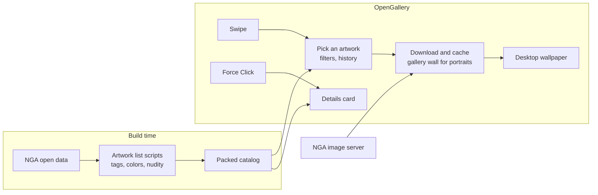

<p align="center">
  
</p>

<h1 align="center">OpenGallery</h1>

<p align="center">
  OpenGallery turns your desktop into a gallery. It sets your wallpaper to one of
  60,000 public-domain works from the
  <a href="https://www.nga.gov/artworks/free-images-and-open-access">National Gallery of Art</a>,
  at full resolution on every screen.
</p>

<p align="center">
  
  
  
  
  
</p>

<p align="center">
  <a href="https://github.com/isaaczaak/opengallery/releases/latest"><b>Download for macOS</b></a>
  · Made by <a href="https://x.com/isaaccyn">Isaac Ng</a>
</p>

<p align="center">
  
  <br>
  <sub>
    <em>Wivenhoe Park, Essex</em>, John Constable, 1816 ·
    <em>Farmhouse in Provence</em>, Vincent van Gogh, 1888 ·
    <em>The Bridge at Argenteuil</em>, Claude Monet, 1874
  </sub>
</p>

## Features

**Rotation:** OpenGallery changes the artwork every hour. You can switch to
every 15 minutes, 3 hours or day, and show the same artwork on every display
or different art on each.

**Filters:** Choose artwork by type, orientation, art movement and palette.
OpenGallery hides nudity by default, using the Gallery's own tags and image
analysis.

**Desktop gestures:** Swipe sideways with two fingers to see the next or
previous artwork. Force Click to see the artwork's title, artist, date and
medium.

**Favorites:** Save up to 20 favorites, and show only those if you like.

**On/off:** Switch OpenGallery off from its menu to get your old wallpaper
back.

OpenGallery runs on Apple Silicon and Intel Macs with macOS 13 or later.

## How it works

**Downloads:** Each image downloads only when it's about to show, sized for
your screen.

**Storage:** About 60 MB in `~/Library/Caches`, which macOS can clear when it
needs space.

**Memory:** About 50 MB.

**Privacy:** OpenGallery only connects to the National Gallery of Art's image
server and collects no data about you. Force Click reads trackpad pressure on
the desktop and nothing else.

## Install

### Download

1. Download the latest **OpenGallery zip** from
   [Releases](https://github.com/isaaczaak/opengallery/releases/latest).
2. Unzip it and move **OpenGallery** to your Applications folder.
3. Open it. Apple hasn't notarized OpenGallery yet, so macOS blocks it the
   first time. Go to System Settings → Privacy & Security, scroll down and
   click **Open Anyway**.

To update, quit OpenGallery from its menu and replace the app with the new
version.

### Build from source

You need macOS 13 or later and Apple's command line tools. To install the
tools, run `xcode-select --install`.

```bash
git clone https://github.com/isaaczaak/opengallery.git
cd opengallery
scripts/bundle.sh --install
```

The script builds OpenGallery, copies it to `/Applications` and opens it.
You built it yourself, so macOS opens it without a security warning. To
update, run `git pull` and `scripts/bundle.sh --install` again.

### After installing

OpenGallery lives in your menu bar, with a small frame icon. Click it to see
what's on each screen, change the artwork, or open Settings. It starts at
login; you can turn that off in Settings.

**Force Click** is off by default. Turn it on in OpenGallery's Settings, then
allow OpenGallery when macOS asks for Input Monitoring. macOS ties this
permission to each version, so allow it again if Force Click stops working
after an update.

**To uninstall**, quit OpenGallery from its menu and delete
`/Applications/OpenGallery.app`.

### Agent prompt

You can also paste this into a coding agent such as Claude Code:

```text
Install OpenGallery, a macOS menu bar app, from
https://github.com/isaaczaak/opengallery.

1. Check this Mac runs macOS 13 or later (sw_vers). If `swift --version`
   fails, run `xcode-select --install`, wait for me to finish the installer,
   then continue.
2. Clone the repo into ~/Code/opengallery (or update it with git pull if it's
   already there) and run `scripts/bundle.sh --install` from inside it.
3. Confirm OpenGallery is running (pgrep -x OpenGallery) and tell me to look
   for its icon in the menu bar.
4. Tell me that Force Click artwork details is optional and off by default:
   to use it, I turn it on in OpenGallery's Settings and allow OpenGallery
   under System Settings → Privacy & Security → Input Monitoring. After a
   future update I may need to allow it again.

Don't use sudo, and don't change any other system or privacy settings.
```

## Development



### Artwork list

`scripts/build_manifest.py` builds `Resources/manifest.json` from the
Gallery's open data. It keeps open-access images at least 2000px on the long
side. Landscape works fill the screen; the app shows portrait and square works
whole, on a gallery wall. Two more scripts tag the artwork and then rebuild
the list:

```bash
scripts/build_manifest.py
scripts/analyze_colors.py      # palette tags, cached in .data/colors.json

# Nudity scores with CLIP, cached in .data/nudity.json
python3 -m venv .data/venv && .data/venv/bin/pip install torch open_clip_torch pillow
.data/venv/bin/python scripts/detect_nudity.py
```

`bundle.sh` compresses the list into the app, and the app unpacks it at
launch. OpenGallery downloads each image at your screen's resolution from the
Gallery's IIIF server and keeps the newest 30 in `~/Library/Caches`.

### App icon

`swift scripts/make_icon.swift` draws the icon and writes
`Resources/AppIcon.icns`. `icon/` holds earlier design explorations; run
`icon/serve.py` and open http://localhost:8765/icon/index.html to view them.

### Layout

- `Sources/OpenGallery/`: the SwiftUI menu bar app and Settings window
- `scripts/`: artwork list, icon, signing and build scripts
- `Resources/`: the artwork list and icon bundled into the app

### Signing

Each build gets a new signature, so macOS forgets OpenGallery's Input
Monitoring permission every time you rebuild. If you rebuild often, run
`scripts/make_signing_cert.sh` once. It adds a self-signed certificate to
your login keychain, trusted only for code signing, and `bundle.sh` signs
with it from then on, so the permission sticks. Any program running as you
can also sign with this certificate and take over that permission. To undo
it, delete the certificate in Keychain Access.

## License

The code is MIT licensed (see `LICENSE`). The artwork images and collection
data come from the National Gallery of Art's
[open access program](https://www.nga.gov/artworks/free-images-and-open-access).
The Gallery releases images of works it believes to be in the public domain
under [CC0](https://www.nga.gov/terms-and-notices#open-access), along with the
collection data. Artwork courtesy National Gallery of Art, Washington.
OpenGallery isn't affiliated with or endorsed by the National Gallery of Art.
